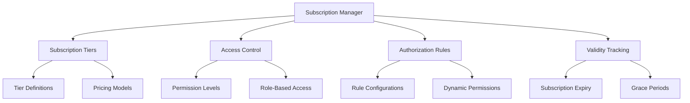

# Subscribe Authorizer

A decentralized subscription management and authorization platform that enables granular access control and subscription verification across web3 services.

## Overview

Subscribe Authorizer provides a robust, blockchain-powered mechanism for managing subscriptions, access rights, and permission verification. The platform offers:

- Flexible subscription model management
- Fine-grained access control
- Permissionless authorization mechanisms
- Transparent subscription tracking
- Secure, non-custodial access validation

## Architecture

Subscribe Authorizer uses a central subscription management contract to handle complex authorization scenarios with minimal friction.



Key system components:
- Subscription Tiers: Define access levels and pricing
- Access Control: Manage granular permissions
- Authorization Rules: Configure complex access logic
- Validity Tracking: Monitor subscription status

## Contract Documentation

### subscription-manager.clar

Core contract managing subscription and authorization functionality.

#### Key Functions

**Subscription Management:**
- `create-subscription-tier`: Define new subscription levels
- `update-subscription-tier`: Modify existing tiers
- `get-subscription-details`: Retrieve tier information

**Authorization:**
- `verify-access`: Check user's access rights
- `grant-permission`: Assign specific access levels
- `revoke-permission`: Remove access rights

**Subscription Operations:**
- `subscribe`: Initiate a new subscription
- `renew-subscription`: Extend existing subscription
- `cancel-subscription`: Terminate active subscription

## Getting Started

### Prerequisites
- Clarinet
- Stacks wallet
- Basic understanding of blockchain subscriptions

### Installation

1. Clone the repository
2. Install dependencies
```bash
clarinet install
```
3. Run tests
```bash
clarinet test
```

### Basic Usage

1. Create a subscription tier:
```clarity
(contract-call? .subscription-manager create-subscription-tier
    "basic-tier"
    "Basic Access"
    u100     ;; Monthly price
    u30)     ;; Duration in days
```

2. Subscribe to a tier:
```clarity
(contract-call? .subscription-manager subscribe
    "basic-tier"
    tx-sender)
```

3. Verify access:
```clarity
(contract-call? .subscription-manager verify-access
    tx-sender
    "premium-feature")
```

## Development

### Testing
```bash
clarinet test
```

### Local Development
```bash
clarinet console
clarinet deploy
```

## Security Considerations

### Permissions
- Granular access control
- Non-custodial design
- Transparent subscription tracking

### Limitations
- Subscription tiers have predefined structures
- Access rules are contract-defined
- Requires active blockchain connection

### Best Practices
- Implement time-based access controls
- Use multiple permission layers
- Regularly update authorization rules
- Conduct thorough security audits